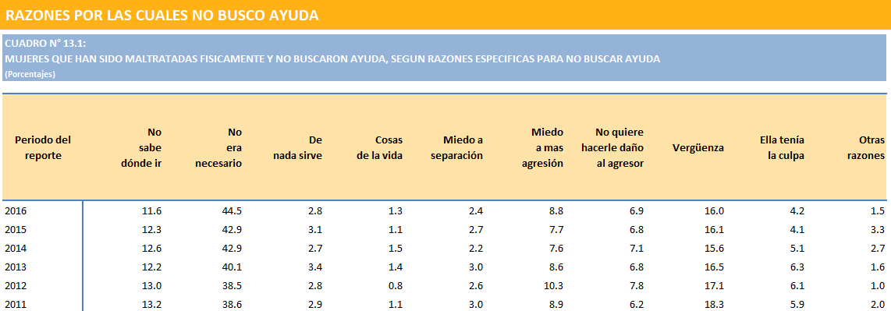

## Lazos de ayuda

Somos el puente entre mujeres víctimas de violencia doméstica y profesionales expertos en áreas de violencia contra la mujer.

### ¿Cómo nace Lazos de yuda?

Actualmente el Perú se encuentra atravezando por una crisis de violencia en contra de las mujeres. Se han hecho diversas campañas y actividades para invitar a la población a tomar acción en esta problemática.

Grupos como [Ni una Menos](https://www.facebook.com/NiUnaMenosPeru.Oficial/) en donde muchas mujeres denuncian los maltratos físicos y/o psicológicos por parte de sus actuales o ex parejas es a donde "Lazos de Ayuda" quiere llegar.
Ahora, no sólo basta con llegar a las víctimas si no también conectarlas con profesionales que quieren sumarse a esta lucha y erradicar la violencia y el abuso hacia las mujeres.

### Datos estadísticos

**En el gráfico 3.1 observamos como la brecha entre el año 2000 y 2016 ha ido disminuyendo. Sin embargo, en el 2016 aún 3 de cada 10 mujeres entre los 15 y 49 años ha sido víctima de violencia física o sexual al menos una vez.**

**En el gráfico 9.1 notamos como las situaciones de violencia aparecen antes de la unión conyugal, pero durante el primer y segundo año se nota con mayor frecuencia.**

**En el cuadro 13.1 se detalle las causas por las cuales las mujeres no buscan ayuda. Lamentablemente notamos como el mayor porcentaje considera que no buscó ayuda porque NO ERA NECESARIO.**

Fuente

[INEI - Brechas de género](http://www.inei.gob.pe/estadisticas/indice-tematico/brechas-de-genero-7913/)

## Research

### Edad de las víctimas

* 32% entre 0 y 17 años
* 62% entre 18 y 59 años
* 6% mayores de 60 años

### El iceberg de la violencia de género

Fuente [Amnistía Internacional](https://www.amnesty.org/es/)

### El desafío

En una entrevista con personal del [Ministerio de la Mujer y Poblaciones Vulnerables](https://www.mimp.gob.pe/) así como de la fundación [Manuela Ramos](http://www.manuela.org.pe/) pudimos detectar una gran problemática.
Existen muchos voluntarios, profesionales dispuestos a ayudar a mujeres víctimas de violencia pero que lamentablemente no tienen el alcance esperado. El estado aún continúa con un sistema burocrático y tradicional y esto origina que los diversos programas y campañas en lucha contra la violencia a la mujer no llegue a cada rincón del país.
Entonces, **¿Como unir a estos profesionales con las mujeres víctimas de violencia?**

En una encuesta realizada vía online quisimos indagar que opinan las personas respecto a este tema y estos fueron los resultados.

